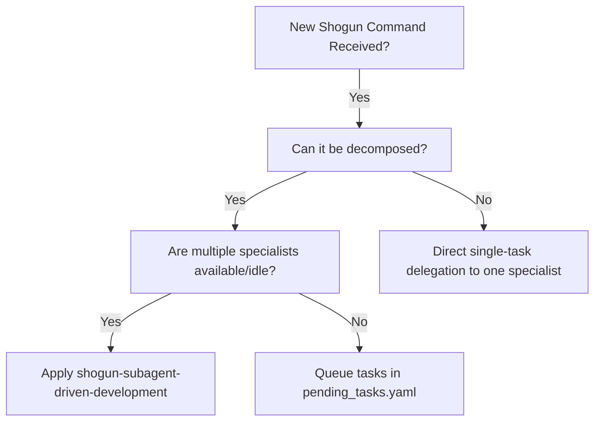
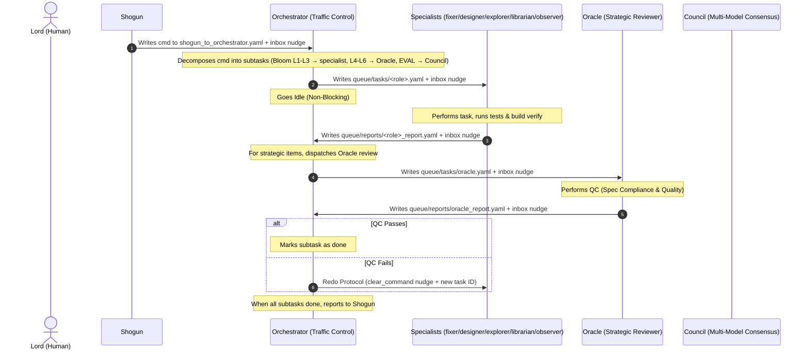

# Subagent-Driven Development (Sengoku Version, v2)

Decompose high-level commands from Shogun and delegate subtasks to **task-layer specialists** (implementation) via the **Orchestrator**, with **Oracle** providing strategic review (Bloom L4-L6) and **Council** providing multi-model consensus, via `queue/tasks/` YAML files and `scripts/inbox_write.sh`.

## North Star
**High-efficiency parallel task execution and strict quality gates (QC) utilizing the v2 Sengoku multi-agent specialist team without direct execution by Orchestrator.**

---

## When to Use



- **Sengoku Task Delegation:** Use when Orchestrator needs to coordinate parallel execution of multiple subtasks across specialists.
- **Strict Quality Control (QC):** Use when every deliverable must pass Oracle review (strategic / L4-L6 / spec compliance + code quality) and optionally Council consensus (EVAL) before being marked complete.

---

## The Process



### 1. Planning and Decomposition (Orchestrator)
- Orchestrator reads the command's `purpose` and `acceptance_criteria` from `queue/shogun_to_orchestrator.yaml`.
- Orchestrator decomposes the command into independent, testable subtasks.
- Orchestrator writes subtasks to `queue/tasks/<role>.yaml` (maximum 1 active task per specialist to prevent concurrency conflicts).
- Orchestrator follows **Bloom Routing**:
  - L1 (recall) → `explorer` (local search)
  - L2 (comprehension) → `librarian` (external research)
  - L3 (application) → `fixer` (tactical implementation) or `designer` (planning)
  - L4 (analysis) → `oracle` (strategic advisor)
  - L5 (synthesis) → `oracle` (or `designer` for design synthesis)
  - L6 (evaluation) → `oracle` for strategic review; `council` for multi-model consensus

### 2. Implementation & Self-Verification (Specialist)
- Specialist reads its assigned YAML, updates status to `in_progress`, and sets the `@current_task` tmux label.
- Specialist implements the task, runs build verification/tests, writes `queue/reports/<role>_report.yaml`, sets status to `done`, and notifies Orchestrator via `inbox_write.sh`.
- Specialist checks its own inbox for any immediate redo/cancellation instructions before going idle.

### 3. Strategic Quality Review (Oracle)
- Oracle reads `queue/tasks/<role>.yaml` and `queue/reports/<role>_report.yaml`.
- Oracle performs **Spec Compliance Check** (ensuring all requirements are met line-by-line, without over-engineering or extra features) and **Code Quality Check** (cleanliness, tests, size limits).
- Oracle writes `queue/reports/oracle_report.yaml` containing the XML `<advice>` block and notifies Orchestrator via `inbox_write.sh`.

### 4. Integration and Resolution (Orchestrator)
- Orchestrator scans all report files upon wakeup.
- If Oracle's review passes, Orchestrator marks the subtask as completed.
- If Oracle's review flags issues, Orchestrator triggers the **Redo Protocol**:
  - Writes a new task YAML with an incremented task_id (e.g. `subtask_001b2`) and `redo_of` field.
  - Sends a `clear_command` inbox message to the specialist to wipe its volatile context.
- Once all tasks are complete, Orchestrator updates the dashboard, records the daily log, and notifies Shogun.

---

## Task YAML Fields Template

### 1. Specialist Task Template (`queue/tasks/<role>.yaml`)

```yaml
task:
  task_id: "subtask_{cmd_id}_{task_name}"
  parent_cmd: "cmd_{cmd_id}"
  bloom_level: L3
  description: |
    Detailed instructions of what to build.
    Prerequisites and files to edit.
  target_path: "path/to/target/file"
  project: "project_name"
  status: assigned
  timestamp: "2026-06-12T00:00:00Z"
```

### 2. Oracle Review Task Template (`queue/tasks/oracle.yaml`)

```yaml
task:
  task_id: "oracle_review_subtask_{cmd_id}_{task_name}"
  parent_cmd: "cmd_{cmd_id}"
  bloom_level: L4
  description: |
    Perform strategic review on the deliverables of subtask_{cmd_id}_{task_name}.
    Verify:
    1. Spec compliance: [Criteria 1]
    2. Code quality: [Criteria 2]
    Write XML <advice> block to queue/reports/oracle_report.yaml.
  target_path: "path/to/target/file"
  project: "project_name"
  status: assigned
  timestamp: "2026-06-12T00:00:00Z"
```

### 3. Council Consensus Task Template (`queue/tasks/council.yaml`)

For high-stakes decisions requiring multi-model consensus (Bloom L5/EVAL), Orchestrator dispatches Council instead of Oracle. Council gathers input from multiple LLM providers and writes a consensus `<advice>` block to `queue/reports/council_report.yaml`.

---

## Handling Status and Blocker Escalation

### done
Proceed to Oracle review (or directly to dashboard if no review needed).

### done_with_concerns
Specialist flags concerns (e.g., file getting too large, pre-existing code is tangled). Oracle analyzes these concerns during review and recommends a path forward in the report.

### blocked / needs_context
Specialist cannot proceed. Orchestrator must:
1. **Provide Context:** If it's a context issue, update the task description/context and re-dispatch.
2. **Upgrade Model:** If the task requires higher reasoning, change the assigned specialist's model in settings or assign it to a different pane.
3. **Decompose Further:** If the subtask is too large, split it into smaller tasks.
4. **Escalate to Lord:** If the plan/acceptance criteria are structurally wrong, Orchestrator escalates to the Lord via Shogun delegation (triggering `scripts/telegram_ask.py` on Shogun) or dashboard.md `🚨 Action Required`.

---

## Red Flags & Safe Defaults

- **Never bypass Orchestrator:** Shogun/Lord must never assign tasks directly to specialists.
- **Never perform direct implementation:** Orchestrator must remain a pure manager/traffic controller.
- **Never trust reports blindly:** Oracle must verify specialist work by reading the actual code diffs.
- **No Concurrent Writes:** Never assign multiple specialists to modify the same file concurrently (prevents git conflicts).
- **Ensure Clean Slate on Redo:** Always send `clear_command` inbox message before re-assigning a task to avoid context pollution.
